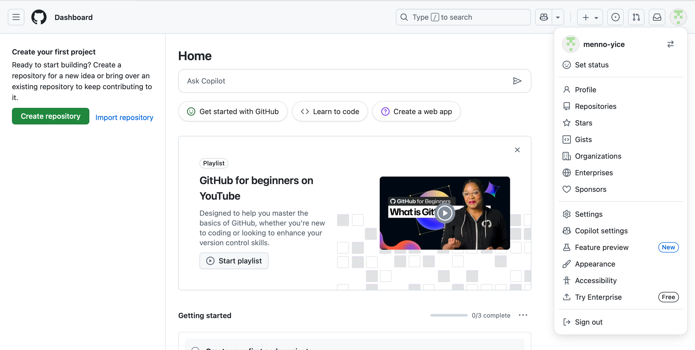

# GitHub tutorial

### Waarom GitHub?

GitHub is gebruikersplatform voor de online source-code management tool git, die door developers wordt gebruikt om aan projecten samen te werken, ze te uploaden en, indien nodig, terug te gaan naar eerdere versies van uitgebrachte applicaties. Git is een erg krachtige tool om software te delen en te herstellen, waardoor het de meest populaire optie is onder software devs.

### Account aanmaken

Maak als volgt een GitHub account aan:

1. Navigeer naar github.com
2. Klik op **Sign up**
3. Vul de benodigde velden in
4. Gebruikersnaam format: 'voornaam-yice'

### Een repository clonen
