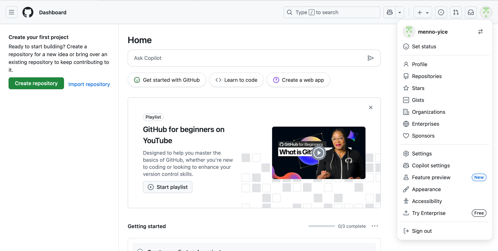
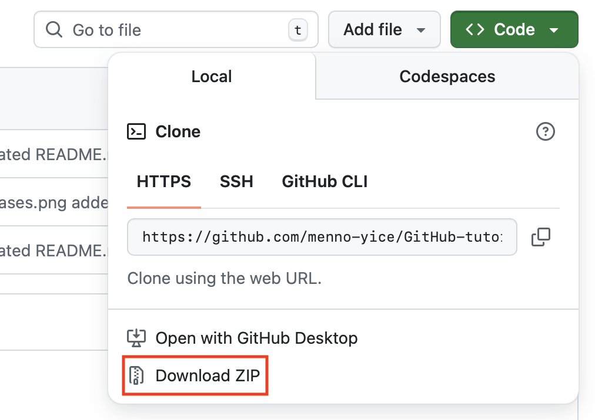
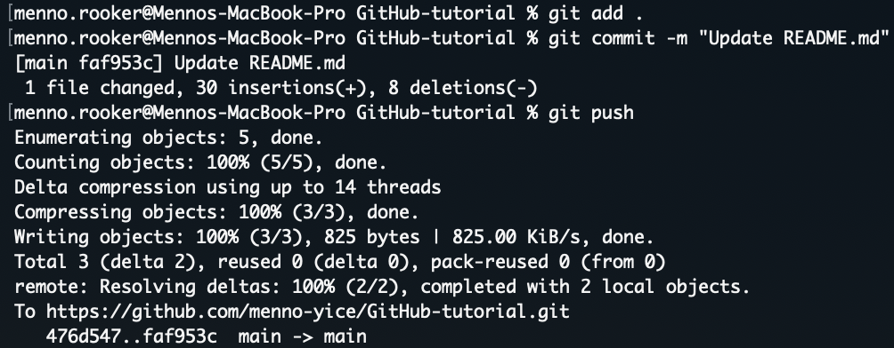

# GitHub tutorial

## Waarom GitHub?

GitHub is gebruikersplatform voor de online source-code management tool Git, die door developers wordt gebruikt om aan projecten samen te werken, ze te uploaden en, indien nodig, terug te gaan naar eerdere versies van uitgebrachte applicaties. Git is een erg krachtige tool om software te delen en te herstellen, waardoor het de meest populaire optie is onder software ontwikkelaars.

## Account aanmaken

Maak als volgt een GitHub account aan:

1. Navigeer naar [github.com](github.com)
2. Klik op **Sign up**
3. Vul de benodigde velden in
4. Gebruikersnaam format: 'voornaam-yice'
5. Stel een wachtwoord in

Na het aanmaken van een account kom je meteen terecht op de **Dashboard** van GitHub:

## Repositories

Git maakt gebruik van projectfolders die 'repositories' (ookwel 'repos' om het kort te houden) worden genoemd. Links op het dashboard zie je de optie om een repo aan te maken of te importeren. Dit zijn echter niet de enige manieren om aan een repo met broncode te komen. Git biedt verschillende manieren om aan de ontwikkelingsmiddelen van projecten te komen, het hangt ervan af wat je wilt. Je hebt:

- **CREATE**

Hiermee creëer je een repo.

- **IMPORT**

Voegt een repo die iemand anders heeft gemaakt toe aan jouw GitHub.

- **CLONE** 

Maakt een lokale kopie van een repo. Zorgt ervoor dat alle developers die aan het project werken hun eigen aanpassingen kunnen doen zonder elkaar in de weg te zitten.

- **FORK**

Maakt een vertakking van de huidige versie van een project, zodat je individueel er aan kunt werken en je eigen aanpassingen kunt toevoegen in een nieuwe versie.

Met een URL kan je ook gewoon een kijkje nemen naar een repo zonder dat je iets hoeft te maken of downloaden. Onderaan de pagina kun je uitleg vinden over een repo in een zogeheten README. Vrijwel elke repo begint met een README.md bestand met praktische informatie en gebruiksinstructies. Het bestand dat je nu leest is overigens als README beschikbaar in een online repo. Navigeer naar: [https://github.com/menno-yice/GitHub-tutorial](https://github.com/menno-yice/GitHub-tutorial)

  

    ℹ️
    

      <strong>Let op:</strong> Repos die door de eigenaar 'public' zijn gemaakt kunnen door iedereen bereikt worden met een URL, terwijl 'private' repos alleen beschikbaar zijn voor diegenen met wie de repo is gedeeld.
    

  

## Downloading

Vaak wil je gewoon de code downloaden op je machine zonder al teveel gedoe. Dit kan meestal in de vorm van .zip bestanden en zo hoef je je niet druk te maken over het ontwikkelen zelf. Bij het downloaden van code op GitHub zijn er wel wat kanttekeningen. Veel projecten hebben helaas GEEN toegewijde 'Download' knop waarmee je de laatste versie van een applicatie kan downloaden. Als gebruiker gaat dit vaak via de **Releases** pagina. Echter, in dit geval is de code te downloaden onder de groene **Code** knop:

Je ziet dan de optie Download ZIP staan:

Plaats het .zip bestand waar je het hebben wilt en *That's it!*
Nu ben je trotse eigenaar van de broncode van de repo. 

## YICE

Aangezien de code van YICE in een private repo staat, moet toegang eerst verstrekt worden door de eigenaar. Zoek contact op met Erik om toegang te krijgen, door hem een mail te sturen en daarin je gebruikersnaam te vermelden, en volg de instructies van deze tutorial om de broncode te installeren.

## Ontwikkelen

Voor het daadwerkelijk ontwikkelen van software zijn er een aantal belangrijke commands vanuit Git die hierbij helpen. We hebben het tot nu alleen nog echt gehad over het delen van projecten, maar vanaf dit punt gaan we wat meer in op het bijdragen aan de broncode.

### Core commands:

Net als bij het verkrijgen van ontwikkelingsmiddelen zijn er bij het ontwikkelen ervan een aantal hoofd commands (core commands) die binnen Git vaak worden gebruikt om bijdrages/veranderingen door te voeren:

- **ADD**

Wanneer je aanpassingen maakt kan je die veranderingen alvast toevoegen aan een potentiële update met ADD. Als je een specifiek bestand wilt toevoegen aan de update gebruik je: 

`git add <filename>` 

of, indien je alle bestanden in het huidige project wilt toevoegen, gebruik je :

`git add .`

Jouw aanpassingen zijn dan ’staged’, maar nog niet officieel gemaakt binnen jouw branch. Het officieel maken doe je met COMMIT.

- **COMMIT** 

De COMMIT command werkt als een soort persoonlijk checkpoint waar je naar terug kunt gaan op een later moment als dat nodig is. Bij het commiten doe je vaak een bericht erbij zoals “Versie 2”. Dit berichtje moet tussen aanhalingstekens doen:

`git commit -m "Versie 2"`

(De `-m` staat voor 'message'. Je kunt ook zonder message commiten, dan gebruik je gewoon "git commit")

Zodra je een commit maakt is het nog steeds niet op de GitHub pagina online te zien, dat doe je met PUSH.

- **PUSH**

Alle commits die je lokaal hebt gemaakt worden online gezet naar GitHub zodat iedereen het kan zien:

`git push`

Dit doe je als je alleen werkt  redelijk vaak aangezien er geen conflicten kunnen zijn tussen 2 devs, maar in een team kan een push voor een “merge conflict” zorgen. Dit gebeurt als 2 mensen aan hetzelfde stukje code hebben zitten werken en Git weet dan niet meer wat hij nou moet accepteren als de correcte versie. Je moet als organisatie of persoon dan handmatig het conflict oplossen door bij elk stukje conflictende code één optie te kiezen. Het mooie is dan wel dat de individuele devs hun beide versies lokaal hebben ge-commit, dus er gaat nooit iets verloren.

- **PULL**

Dit is het tegenovergestelde van PUSH en dit gebruik je wanneer iemand al eerder iets naar GitHub heeft ge-pusht en je wilt de geüpdate versie hebben om mee verder te werken:

`git pull`

PULL kan ook voor merge conflicts zorgen omdat je weer overlap kan hebben tussen wat jezelf hebt gedaan en wat een ander heeft gedaan. Het is daarom ook van belang dat je PULL gebruikt VÓÓRDAT je PUSH gebruikt als je in een team werkt. Dan kan je lokaal alvast het conflict oplossen i.p.v. met een PUSH die meteen op het web komt te staan met alle conflicten van dien.

Een voorbeeld van een workflow op de command-line zou er dus als volgt uit kunnen zien:

### Overige commands:

Naast de core commands zijn er hier nog wat aanvullende commands die handig zijn om te weten:

`git status` -> geeft een overzicht van alle dingen die al of nog niet 'staged' zijn voor een commit.

`git branch` -> bekijk welke branches er zijn en op welke je momenteel aan het werken bent.

`git log` -> geeft een overzicht van de meest recente commits.

`git fetch` -> haal updates binnen zonder te merge’en; combineer met `git merge` of `git rebase`.

