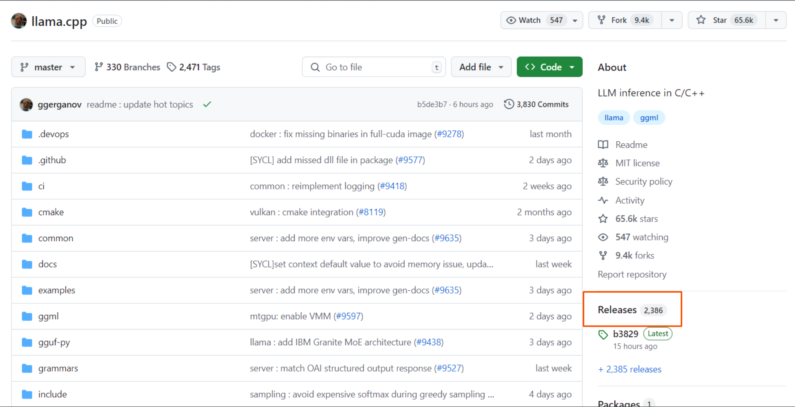

## GitHub tutorial

### Waarom GitHub?

GitHub is gebruikersplatform voor de online source-code management tool Git, die door developers wordt gebruikt om aan projecten samen te werken, ze te uploaden en, indien nodig, terug te gaan naar eerdere versies van uitgebrachte applicaties. Git is een erg krachtige tool om software te delen en te herstellen, waardoor het de meest populaire optie is onder software devs.

### Account aanmaken

Maak als volgt een GitHub account aan:

1. Navigeer naar [github.com](github.com)
2. Klik op **Sign up**
3. Vul de benodigde velden in
4. Gebruikersnaam format: 'voornaam-yice'

Na het aanmaken van een account kom je meteen terecht op de **Dashboard** van GitHub:

### Repositories

Git maakt gebruik van projectfolders die 'repositories' (ookwel 'repos' om het kort te houden) worden genoemd. Links op het dashboard zie je de optie om een repo aan te maken of te clonen. Clonen houdt in dat je een eigen kopietje maakt van een project van iemand anders, waardoor je hier aan kunt werken zonder dat die persoon daar last van heeft. Repos die door de eigenaar 'public' zijn gemaakt kunnen door iedereen bereikt worden met een URL, terwijl 'private' repos alleen beschikbaar zijn voor diegenen met wie de repo is gedeeld.

### Downloads

Naast het clonen van de broncode kan je op GitHub vaak natuurlijk ook gewoon de programma's en applicaties zelf downloaden. Veel projecten hebben helaas GEEN toegewijde 'Download' knop waarmee je de laatste versie van een met Git gedeelde applicatie kan downloaden. Downloaden als gebruiker kan vaak via de **Releases** pagina:

Hier kun je onder **Assets** vaak de verschillende versies als een .zip bestand downloaden:

Als de installatie iets anders loopt staat dit vaak in een README.md bestand. Developers geven vaak uitleg over de installatie en het gebruik van hun software in dit bestand, als een repo een README.md heeft is deze vaak direct te zien zodra je de repo bekijkt op GitHub als je naar beneden scrollt. De '.md' extensie duidt aan dat dat de README in 'markdown' is geschreven. Dit is een zogeheten 'markup language' die text op een nette manier formatteert zodat het eindresultaat als PDF of HTML document kan worden geëxporteerd. Deze tutorial is bovendien in markdown geschreven en staat als README in een openbare repo op GitHub, waar jullie met de volgende URL toegang tot kunnen krijgen: [https://github.com/menno-yice/GitHub-tutorial](https://github.com/menno-yice/GitHub-tutorial)

